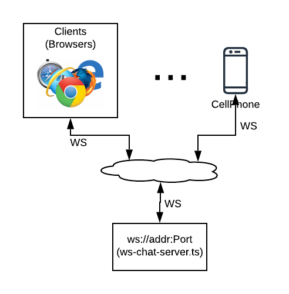
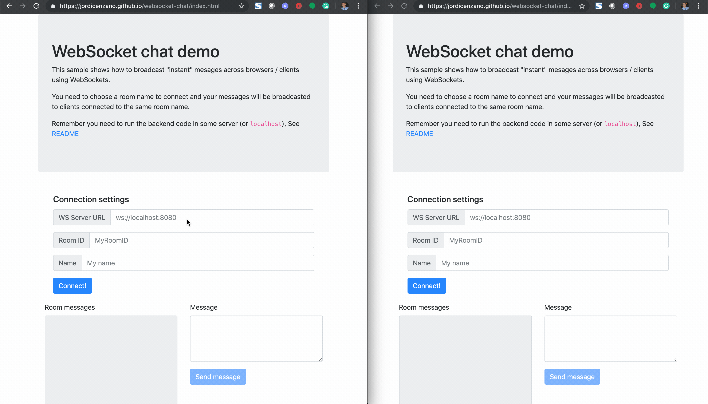

# websocket-chat
This is a simple POC that shows how to broadcast "instant" messages across browsers / clients using WebSockets and avoiding any polling.
The goal of building this POC was just test WebSockets and increase the knowledge about this technology.





# Installation
1. Install [NodeJS](https://nodejs.org) (version 12+), we recommend doing that using [NVM](https://github.com/nvm-sh/nvm#installation-and-update)
2. Install typescript utils (recommended globally)
```
npm install -g ts-node
npm install -g typescript
```
3. Clone this repo:
```
git clone git@github.com:jordicenzano/websocket-chat.git
```
3. Install packages (from the app directory)
```
npm install
```

# Test it
1. Start the backend webSocket server code in a place where the clients can reach, for instance:
```
ts-node ./server/src/ws-chat-server.ts -p 8080
```
The previous command will run the server in your computer on port 8080

2. Load this webpage in your device [WebSocketChat](https://jordicenzano.github.io/websocket-chat/index.html)

3. Type `ws://localhost:8080` (OR your server location) as `WS Server URL` (*)
4. Type `myroom` (OR the room name you want) in `Room ID`
5. Type  `RANDOM` (OR the ID you want) in `Name`
6. Press the "Connect" button
7. Repeat steps 2 to 6 with as many clients as you want
8. Send a messages

Tested with Chrome in MACOS.

(*) Some browsers (like Safari) can throw an error if you try to connect an NON encrypted WebSocket (ws:) from a HTTPS page.